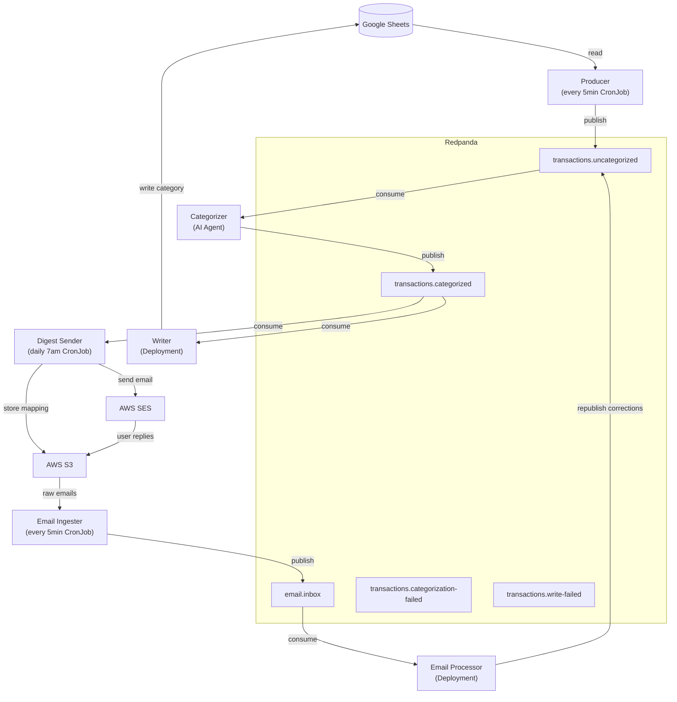

# Bookkeeper Agent


---

### Don't want to self-host? We're building a hosted version.

### [Sign up for the waitlist →](https://airtable.com/appXQb0Zj4cMf7uWt/pag0S4I4BFZX0LxWU/form)

AI-powered transaction categorization for your spreadsheet — no infrastructure required.

---


Automated transaction categorization for bookkeeping spreadsheets. Reads uncategorized transactions from your Google Sheet, uses an AI agent to determine the correct category, and writes the result back. Supports [Tiller](https://www.tillerhq.com/) spreadsheets out of the box.

Includes a daily email digest so you can review categorizations and reply to correct mistakes — corrections are automatically re-categorized.

## Architecture

Six services packaged as a single Docker image with different entrypoints, connected via Kafka (Redpanda):



### Categorization Pipeline

**Producer** — CronJob (every 5 min). Polls the Google Sheet for uncategorized transactions and publishes them to Kafka.

**Categorizer** — Deployment (3 replicas). AI agent that consumes uncategorized transactions, researches the correct category using tool calls (sheet history lookup, AutoCat rules, web search), and publishes the result.

**Writer** — Deployment (1 replica). Consumes categorized transactions and writes the category back to the sheet.

### Email Digest & Correction Pipeline

**Digest Sender** — CronJob (daily at 07:00 UTC). Reads the last 24 hours of categorized transactions, sends a numbered summary email via SES, and stores a number-to-transaction-ID mapping in S3 for later lookup.

**Email Ingester** — CronJob (every 5 min). Pulls raw reply emails from the S3 `inbox/` prefix (delivered there by SES receipt rules), parses the MIME body, publishes to the `email.inbox` Kafka topic, and moves the file to `ingested/`.

**Email Processor** — Deployment (1 replica). Consumes from `email.inbox`, parses correction lines (e.g. `3: Groceries`), loads the mapping from S3 to resolve transaction IDs, and republishes them to `transactions.uncategorized` with the user's context in the `note` field — triggering re-categorization by the AI agent.

### Reply-to-Recategorize Flow

1. You receive a daily digest email listing numbered transactions:
   ```
   1. AMAZON MARKETPLACE        $42.99   Shopping
   2. SHELL OIL 12345           $55.00   Gas
   3. COSTCO WHOLESALE          $187.32  Groceries
   ```
2. Reply to the email with corrections, one per line:
   ```
   2: That was a road trip, put it in Travel
   3. This was for the office, use Office Supplies
   ```
3. The system ingests your reply, re-publishes the flagged transactions with your context, and the AI agent re-categorizes them taking your feedback into account.

## Prerequisites

- A [Tiller](https://www.tillerhq.com/) spreadsheet with the standard Transactions tab
- A Google Cloud service account with access to the spreadsheet
- A Kafka-compatible broker (tested with [Redpanda](https://redpanda.com/))
- An [OpenRouter API key](https://openrouter.ai/keys)
- (Optional) A [Brave Search API key](https://brave.com/search/api/) for web search
- (For email digest) AWS account with SES, S3, and IAM — see [AWS Infrastructure](#aws-infrastructure)

## Configuration

All configuration is via environment variables:

| Variable | Required By | Description |
|---|---|---|
| `KAFKA_BOOTSTRAP_SERVERS` | All | Kafka/Redpanda broker address |
| `SCHEMA_REGISTRY_URL` | All | Schema registry URL |
| `GOOGLE_SHEET_ID` | All | Spreadsheet ID from the Google Sheets URL |
| `GOOGLE_CREDENTIALS_JSON` | All | Path to service account JSON key file |
| `OPENROUTER_API_KEY` | Categorizer | OpenRouter API key |
| `MODEL` | Categorizer | Model to use (default: `anthropic/claude-sonnet-4-6`) |
| `BRAVE_API_KEY` | Categorizer | Brave Search API key (optional) |
| `ADDITIONAL_CONTEXT_PROMPT` | Categorizer | Extra context about the user for the agent (optional) |
| `METRICS_PORT` | Categorizer, Writer, Email Processor | Prometheus metrics HTTP port (default: `9091`) |
| `PUSHGATEWAY_URL` | Producer | Pushgateway URL for one-shot metrics (optional) |
| `MAX_TRANSACTION_AGE_DAYS` | Producer | Skip transactions older than N days (default: 365) |
| `MAX_TRANSACTIONS` | Producer | Limit transactions per run, 0 = unlimited (default: 0) |
| `AWS_REGION` | Email services | AWS region (default: `us-east-1`) |
| `S3_BUCKET` | Email services | S3 bucket for email storage and mappings |
| `SES_FROM_ADDRESS` | Digest Sender | SES-verified sender address (e.g. `digest@bookkeeper.jevy.org`) |
| `DIGEST_TO_ADDRESS` | Digest Sender | Recipient email address for digests |
| `AWS_ACCESS_KEY_ID` | Email services | IAM credentials for SES + S3 access |
| `AWS_SECRET_ACCESS_KEY` | Email services | IAM credentials for SES + S3 access |

## AWS Infrastructure

The email digest feature requires a small set of AWS resources. A setup script is provided:

```bash
scripts/aws-setup.sh
```

The script is idempotent and creates the following if they don't already exist:

| Resource | Name / ID | Purpose |
|---|---|---|
| SES domain identity | `bookkeeper.jevy.org` | Send and receive email |
| Route53 TXT record | `_amazonses.bookkeeper.jevy.org` | SES domain verification |
| Route53 MX record | `bookkeeper.jevy.org` | Route inbound email to SES |
| S3 bucket | `bookkeeper-emails-jevy` | Store raw emails and transaction mappings |
| SES receipt rule set | `bookkeeper-rules` | Active rule set for inbound email |
| SES receipt rule | `bookkeeper-s3-ingest` | Deliver emails to S3 `inbox/` prefix |
| IAM user | `bookkeeper-ses-s3` | Scoped credentials for the application |
| IAM policy | `bookkeeper-ses-s3-policy` | Permissions for SES send + S3 read/write |

Run the script once to provision, then again to verify — it should report no changes on the second run.

The S3 bucket uses three prefixes:
- `inbox/` — Raw emails delivered by SES
- `ingested/` — Emails picked up by the ingester
- `processed/` — Emails fully handled by the processor
- `mappings/` — Daily digest number-to-transaction-ID JSON maps

## Running Locally

Start the infrastructure and all three services with Docker Compose:

```bash
cp .env.example .env  # fill in your API keys and sheet ID

docker compose up
```

Or run individual services:

```bash
docker compose up producer
docker compose up categorizer
docker compose up writer
```

The email digest services require AWS credentials and are not included in the compose stack — run them against a live AWS environment.

## Deployment

Container images are published to GitHub Container Registry on tagged releases:

```bash
docker pull ghcr.io/jevy/bookkeeper-agent:0.8.3
```

Kubernetes manifests are provided in `k8s/` using Kustomize:

```bash
kubectl apply -k k8s/
```

You'll need to create a `bookkeeper` Secret in your namespace with the required API keys and credentials.

## Building

Requires JDK 21.

```bash
./gradlew build          # compile + test
./gradlew installDist    # build distributable
docker build -t bookkeeper-agent .
```

## Releasing

Tag a version and push to trigger a release build:

```bash
git tag v0.8.3
git push --tags
```

This produces image tags: `0.8.3`, `0.8`, and `latest`.

## License

MIT
